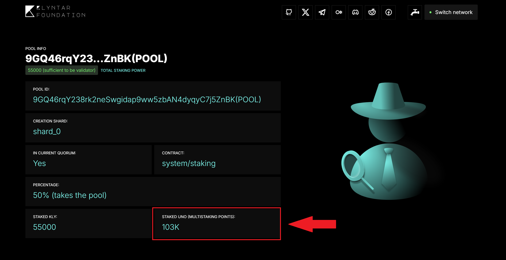

# ☁️ Build the core

## 1. Golang installation

<figure><figcaption></figcaption></figure>

First part of Klyntar is written using Go language, so you need to install it. Use this guide to install Golang for your platform & architecture



Or, check if you already have Go

```sh
go version
```

## 2. Node.js installation

<figure><figcaption></figcaption></figure>

Part of core is written on Node.js so you should to install it. If you already have installed, we recommend checking the version. The recommended version is **v21.4.0**



```sh
johndoe@klyntar:~$ node -v
v21.4.0
```



```sh
C:\Users\JohnDoe>node -v
v21.4.0
```



Use official guides to install Node.js for your platform (Windows/Linux/Mac)



## 3. PNPM installation

<figure><figcaption></figcaption></figure>

As a package manager for Node.js we use pnpm. To install it globally, run:

```sh
npm install -g pnpm
```

## 4. PM2 for production process management installation

<figure><figcaption></figcaption></figure>

PM2 is a production process manager for Node.js applications with a built-in load balancer. It allows you to keep applications alive forever, to reload them without downtime and to facilitate common system admin tasks.

**You can install it globally using the command:**

```sh
npm install pm2 -g
```



PM2 allows you to manage and monitor a node/validator in production mode. So, you can simply start the node/validator via PM2 to:

1. Run the node as a background service - so you can close the console, close the SSH connection to server and node will work on background
2. Have access to logs stream to monitor node status

Here are some useful commands

```
pm2 start <service_name> - to start the core as background service
pm2 stop <service_name> - to stop the core
pm2 monit <service_name> - start console dashboard with logs, memory usage, etc.
pm2 logs <service_name> - start logs stream
pm2 logs <service_name> --lines <x> --nostream - read last X lines of logs from error stream and normal logs stream
```
